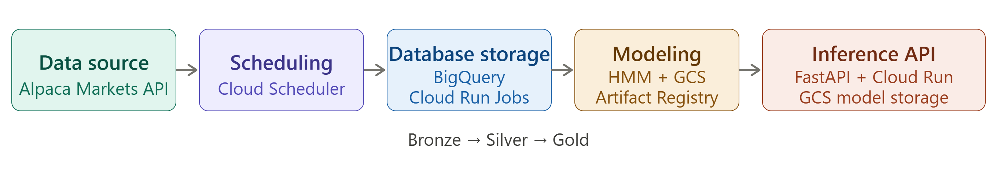
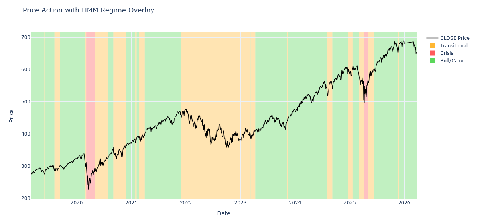
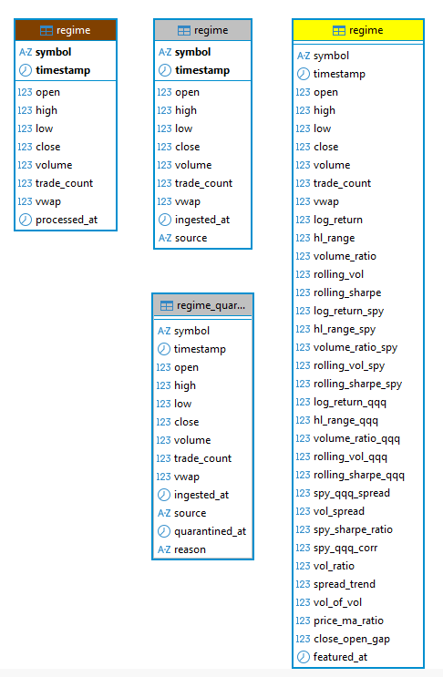
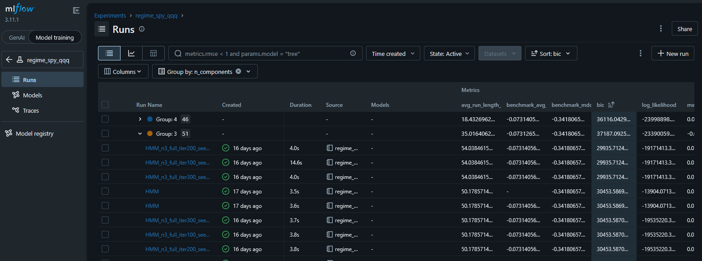
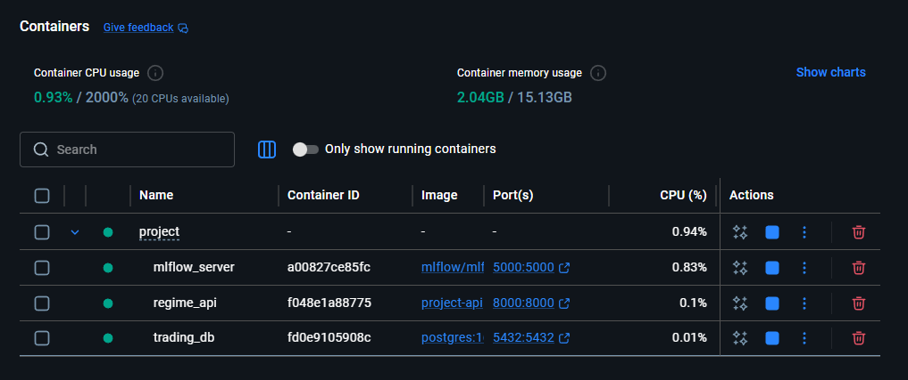
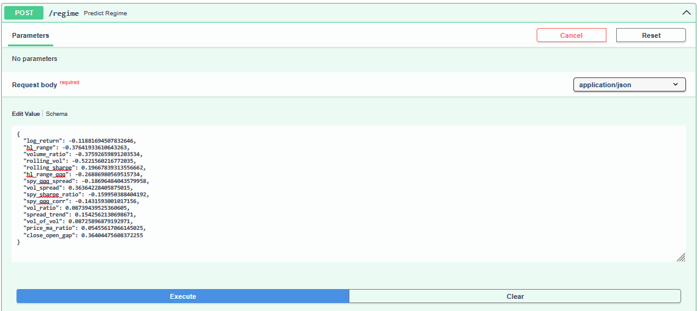
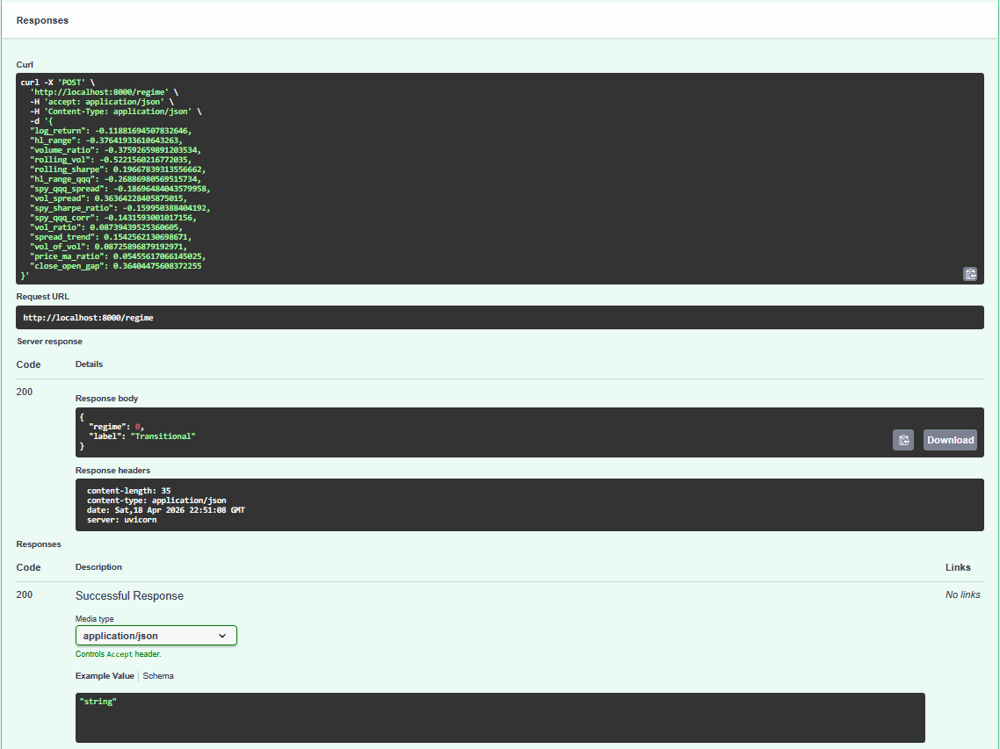

## Market Regime Detection Signal for Trading Usage

An unsupervised market regime detection on SPY/QQQ using Hidden Markov Models, built on a production-style medallion architecture. This enables reusability and serves as a launching pad for all future personal algorithm trading purposes.

### Overview

Latent market regimes aren't directly observable. Although this isn't a new discovery, HMM can infer and provide a useful signal especially when it comes to loss prevention on max draw-down.

I built a full medallion architecture pipeline that utilizes Alpaca API to query historical data continuously and engineer features that feed into my HMM model training. The end result is served on a Fast API endpoint for usage in trading bots / strategies.

Research was done before-hand and determined that 3-state HMM with full covariance won, with a BIC ~29,936. This means that distinct bull, crisis, and transitional regimes with meaningfully different Sharpe ratios and draw down profiles were identified.

The pipeline is fully deployed on GCP. Daily ingestion and feature engineering runs as a scheduled Cloud Run Job writing to BigQuery, model artifacts are stored in GCS, and the regime signal is served via an authenticated FastAPI endpoint on Cloud Run.

### Architecture Diagram

  

  

### HMM Results

Regime overlay on SPY price action. Results of winning model shows an average of 54 day runtime with 26 total transitions. This clearly tracks with known historical events and shows that it can serve as a reliable signal detector.

  

### Medallion Architecture

The image below shows all layer separations along with what was feature engineered on the gold layer.

  

### MLflow Runs

90-run grid search across n_components, covariance type, iterations, and random seed.

  

### Docker Setup

Three-container stack with trading_db, mlflow_server, and regime_api.

  

### FastAPI Swagger

POST /regime accepts scaled feature vector, and returns the regime label. The following is a test run done on one of the samples from testing data.

  

  

### Tech Stack

| Category | Tools |
|----------|-------|
| Languages | Python, PowerShell, SQL |
| Storage | PostgreSQL, Docker Compose |
| Modeling | hmmlearn, scikit-learn, MLflow |
| API | FastAPI, Uvicorn |
| Visualization | Plotly |
| Cloud | GCP (BigQuery, Cloud Run, Cloud Scheduler, GCS) |

### GCP Cloud Deployment
The pipeline has been migrated to a production cloud architecture on GCP.

**Pipeline:** Bronze → Silver → Gold scripts run as a Cloud Run Job, triggered daily at 4:30pm ET via Cloud Scheduler. Market data flows from Alpaca API through BigQuery medallion tables.

**Model:** HMM trained on Gold layer features, artifacts (model.pkl, scaler.pkl, feature_cols.json) stored in GCS.

**API:** FastAPI deployed on Cloud Run, loads model from GCS on startup and serves live regime predictions.

| Component | GCP Service |
|-----------|-------------|
| Data Warehouse | BigQuery |
| Pipeline Execution | Cloud Run Jobs |
| Scheduling | Cloud Scheduler |
| Model Storage | Cloud Storage (GCS) |
| API Serving | Cloud Run Service |
| Container Registry | Artifact Registry |

### Roadmap

- Main functionalities (done)
- FastAPI /regime endpoint (done)
- GCP cloud deployment (done)
- Trading bot integration with Alpaca paper trading (in progress)
- Grafana monitoring dashboard
- Trading bot and automated retraining pipeline triggered by threshold monitoring to account for drift
- XGBoost supervised layer using HMM regime labels